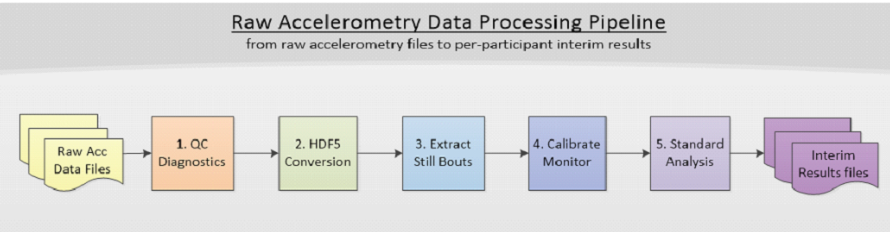

# Raw Accelerometry Data Pipeline

The PAMPRO processing pipeline scripts described here use many, but not all, of the functions contained in the `pampro` module.



## Tasks

Pampro processing pipeline comprises five distinct stages which are meant to be executed in order. These stages are recognized using the keywords below:

1. `qcdiagnostics` – QC Diagnostics on raw data files  
2. `hdf5conversion` – Conversion of the raw files to an HDF5 format  
3. `extractstillbouts` – Inferring still bouts from accelerometer data  
4. `calibratemonitor` – Multi-file calibration of individual accelerometer devices  
5. `standardanalysis` – Statistical analysis performed on each HDF5 file, either using individual-file or multi-file calibration from the calibratemonitor task.

Each of the five steps involves a Python processing script in the `ppscripts` folder which calls on the `pampro` module's functionality.  
Currently, this pipeline supports only Axivity AX3 (.cwa files) and GENEActiv monitor (.bin files).

---

## Downloading Pampro Package and the Pipeline Scripts

Use the command line to navigate to your desired folder location and run the following command to download the package and scripts from a specific branch (feature-ppscripts) of the pampro repository:

```bash
git clone -b feature-ppscripts https://github.com/antony-epid/pampro
```

---

## Installation

You will now have a local repository containing the pampro and ppscripts modules which must be installed into your Python environment.
Assuming that you have loaded your Python environment, you should have the pip module available.

Install the package using pip where <pampro_folder> is the top-level repository folder (which contains the setup.py file): 

```bash
pip install <pampro_folder>
```

To verify installation:

```bash
pip show pampro
```
This will display metadata about the module.

Once you have the packages installed in the environment, you can start processing the raw accelerometer files using the processing scripts in ppscripts folder by folllowing the steps below.

---

## Creating a New Project

This section is only for a new project that you want to create or if you want to repeat an exisiting project in a different directory. This can be useful if you want to perform some tests or some dummy processing.  

Suppose you are in a directory called PROJ. In order to create a new project, you can begin by creating a directory for that project and moving to that directory. For example, if you want to name the new project 'TestPampro', you can do the following : 

```bash
[abc123@login-p-2 PROJ]$ mkdir TestPampro 
[abc123@login-p-2 PROJ]$ cd TestPampro 
```

Now that you are in the project directory (TestPampro), run the script init_proj.sh (which is already installed by pip in your environment) to create the minimum set of subdirectories and files required to run pampro processing.   

```bash
init_proj.sh <projectdir> <monitortype>
```
where `<projectdir>` is the project directory and `<monitortype>` is either 'Axiv' (for Axivity) or 'Gene' (for GENEActiv). If you are in the project folder (TestPampro) you can use '.' for `<projectdir>` instead of the full path such as the following command : 

```bash
[abc123@login-p-2 TestPampro]$ init_proj.sh . Axiv
```
You can then check the list of subdirectories created inside the project directory TestPampro: 

```bash
[abc123@login-p-2 TestPampro]$ ls 
```

The following subdirectories will be created:

```
_anomalies  _config  _hdf5  _logs
_plots      _data                _results   _stillbouts
```
At this point, the only subdirectory which is not empty is _config

```
_config/
├── general_settings.csv
└── standardanalysis_settings.csv
```

This subdirectory is provided with two setting files : general_settings.csv can be used as the setting file for the first four tasks (qcdiagnostics, hdf5conversion, extractstillbouts, calibratemonitor) whereas standardanalysis_settings.csv file contains the list of setting required by the standardanalysis task only. These default settings files contain the paths required by the processing and they are set in reference to `<projectdir>`. 
  
The other subdirectory which needs to be populated is `_data` where your raw input files (e.g. `*.cwa`) reside.  


---

## Running Pampro Processing Tasks

All you need to run a pampro processing task are the input files and a setting file. You can actually edit the setting files and set the location of the subdirectories freely if your input files are located elsewhere or if you want the outputs go to different directory. 

Assuming that you have filled the '_data/' directory with input files, you may start processing the files with pampro by using the task keywords. 

The command line syntax is : 

```bash
<pampro_task> <setting_file>
```

Where:

- `<pampro_task>`: One of  
  `run_qcdiagnostics`, `run_hdf5conversion`, `run_extractstillbouts`, `run_calibratemonitor`, `run_standardanalysis`
- `<setting_file>`: `_config/general_settings.csv` or `_config/standardanalysis_settings.csv`

**Examples:**
If you want to run QC diagnostics and you are in TestPampro directory, you may run it using the following command line :  

```bash
run_qcdiagnostics _config/general_settings.csv
```
whereas for standard analysis:
```bash
run_standardanalysis _config/standardanalysis_settings.csv
```

Alternatively, you can run them as Python modules:

```bash
python -m ppscripts.run_qcdiagnostics _config/general_settings.csv
python -m ppscripts.run_standardanalysis _config/standardanalysis_settings.csv
```

### Output Log Files

Once a task completes, it generates a log file in `_logs/`, named using the pattern:

```
<filename>_<task>_<exit_status>.csv
```

E.g.,

```
PBM-3071-9_dfd02670-79f2-11ed-87c2-2dd71dc0f57d_hdf5conversion_completed_0.csv 
PBM-3071-9_dfd02670-79f2-11ed-87c2-2dd71dc0f57d_qcdiagnostics_completed_0.csv 
PBM-3113-9_259f3560-745d-11ed-8187-a965cb6b_hdf5conversion_unsuccessful_0.csv 
PBM-3113-9_259f3560-745d-11ed-8187-a965cb6b_qcdiagnostics_unsuccessful_0.csv 
```
Notice that the exit status of the process is either 'completed' or _'nsuccessful'. If pampro did not complete the task, no pampro log file was produced in subdirectory _logs.   

To rerun a task for a specific file, simply delete its log file.

---

## Other Output Files by Task

| Task               | Output Locations                                     |
|--------------------|------------------------------------------------------|
| **qcdiagnostics**  | `_logs`, `_results`, `_anomalies`, `_plots`         |
| **hdf5conversion** | `_logs`, `_hdf5`, `_results`                         |
| **extractstillbouts** | `_logs`, `_results`                              |
| **calibratemonitor** | `_logs`, `_results`                               |
| **standardanalysis** | `_logs`, `_results`, `_plots`                     |

---

## Full Pipeline

To automate the pipeline, write a script that performs all tasks in sequence.  
Note that you can perform the first 3 tasks on individual files independently, however the calibratemonitor task needs to wait for the outcome of the preceding task (extractstillbout) from all files in order to carry out the multi-file calibration. 

